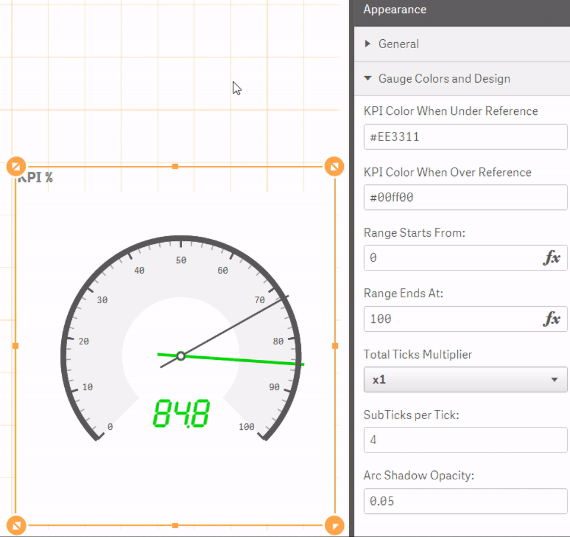

# Sense-Speedometer-with-Reference-Line
D3-code-based speedometer with conditional coloring of KPI indicator dependant on a reference indicator.

Developed by Fady Heiba, based on D3.js

Display KPI's on a speedometer based on a reference line.
If the KPI indicator (first measure) exceeds the reference indicator (second measure), then the KPI indicator turns green. If it falls short, it turns red.
Typically used to visualize percentage KPI's as compared to their benchmark value.

The extension is based on the following D3 code:
http://bl.ocks.org/metormote/6392996

Changelog:

V1 : First Upload

V1 with Examples

V1.1 : Added the option to remove the reference line. It's a normal speedometer with one indicator when it receives one measure, and a reference line is automatically drawn if you add the second measure.

V1.1 with GIF Example

v2.0 : Added Preferences for indicators' colors, range start and end, total ticks multiplier, subticks per tick, and the opacity of the arc's background shadow.

